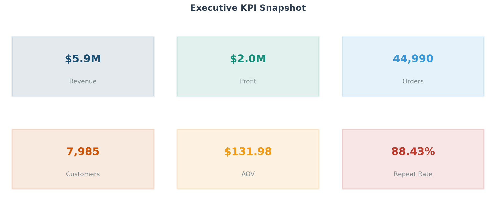
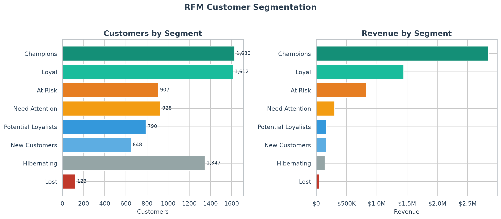
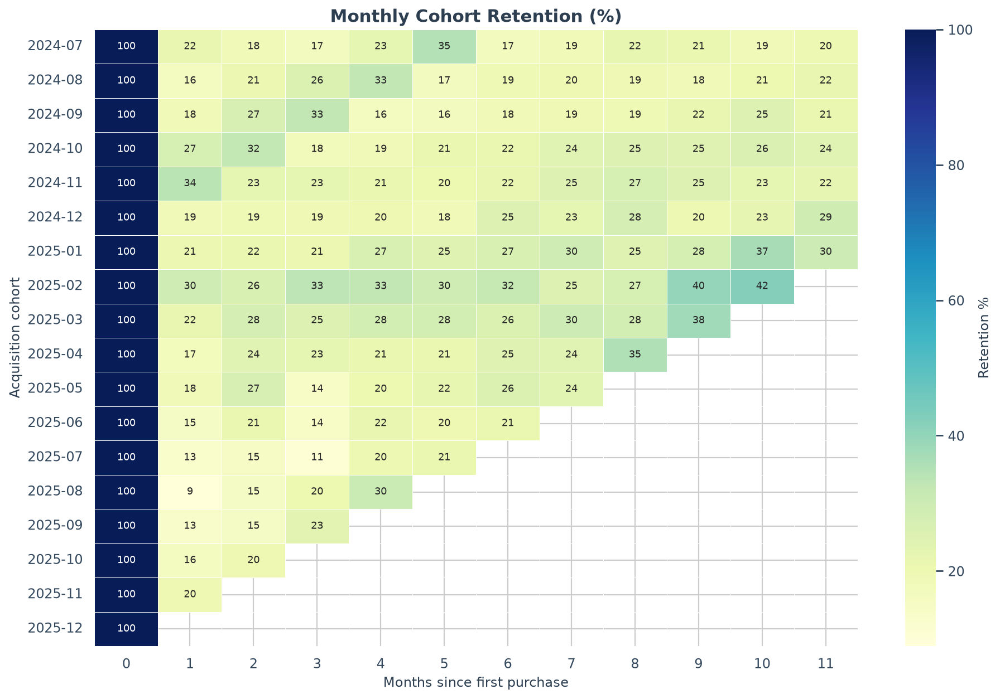

# Retail Revenue Intelligence

### End-to-end e-commerce analytics for portfolio demonstration

A production-style analytics project that turns multi-year order data into **executive KPIs**, **RFM customer personas**, **cohort retention**, **ABC product analysis**, and an **interactive Streamlit dashboard**.

| | |
|---|---|
| **Domain** | E-commerce / retail growth |
| **Stack** | Python · pandas · scikit-learn utils · matplotlib/seaborn · Plotly · Streamlit |
| **Scale** | ~115K line items · ~45K orders · ~8K customers · 3 years |
| **Outputs** | Static report figures · markdown insights · JSON summary · live dashboard |

---

## Why this project

Hiring managers care less about “I know pandas” and more about whether you can:

1. **Clean messy transactional data** with a measurable quality report  
2. **Frame business questions** (who drives revenue? who is slipping away?)  
3. **Segment customers** with a standard, explainable method (RFM)  
4. **Measure retention** with acquisition cohorts  
5. **Prioritize products** with ABC analysis and margin context  
6. **Ship insights** as charts, narrative, and an interactive app  

This repo is structured like a small analytics codebase — not a single throwaway notebook.

---

## Key results (reproducible run)

Analysis window: **2023-01-01 → 2025-12-31**

| Metric | Value |
|--------|------:|
| Total revenue | **$5.94M** |
| Total profit | **$2.01M** (33.9% margin) |
| Orders | **44,990** |
| Active customers | **7,985** |
| Average order value | **$131.98** |
| Repeat purchase rate | **88.4%** |

### Story in three charts

**Executive snapshot**



**RFM: ~20% of customers (Champions) drive ~48% of revenue**



**Monthly cohort retention**



### Business takeaways

1. **Protect Champions** — high frequency + monetary, recent buyers. VIP treatment beats broad discounts.  
2. **Win-back At Risk** — historically valuable but going cold (~14% of revenue still sits here).  
3. **Electronics is an A-category on revenue** but thinner margin; pair with high-margin Fashion/Beauty attach.  
4. **Early retention is the lever** — M1 cohort retention ~18%; onboarding sequences are high-ROI experiments.  
5. **Web leads revenue**; Marketplace is a growth/test surface for assortment.

Full narrative: [`reports/insights.md`](reports/insights.md)

---

## Project structure

```
retail-revenue-intelligence/
├── config.yaml                 # seeds, paths, viz palette
├── requirements.txt
├── README.md
├── scripts/
│   └── run_analysis.py         # one-command end-to-end pipeline
├── src/
│   ├── config.py               # config loader
│   ├── generate_data.py        # reproducible synthetic retail data
│   ├── cleaning.py             # quality checks + enrichment
│   ├── rfm.py                  # RFM scores + personas
│   ├── cohorts.py              # monthly retention matrix
│   ├── metrics.py              # KPIs, ABC, channel/region, insights
│   └── viz.py                  # publication-quality static charts
├── dashboard/
│   └── app.py                  # Streamlit interactive app
├── data/
│   ├── raw/                    # customers, products, transactions
│   └── processed/              # clean orders, RFM, cohorts
├── reports/
│   ├── figures/                # 00–08 PNG portfolio charts
│   ├── insights.md
│   └── executive_summary.json
└── notebooks/
    └── 01_walkthrough.ipynb    # optional narrative walkthrough
```

---

## Quick start

```bash
# 1. Clone / enter project
cd retail-revenue-intelligence

# 2. Virtual environment
python3 -m venv .venv
source .venv/bin/activate
pip install -r requirements.txt

# 3. Generate data + run full analysis
python scripts/run_analysis.py

# 4. Interactive dashboard
streamlit run dashboard/app.py
```

Re-run analysis without regenerating raw data:

```bash
python scripts/run_analysis.py --skip-generate
```

---

## Methodology

### 1. Data model

Synthetic but realistic multi-year e-commerce data (fixed seed in `config.yaml`):

| Table | Grain | Highlights |
|-------|-------|------------|
| `customers` | 1 row / customer | region, tier, signup, demographics |
| `products` | 1 row / SKU | category, brand, price, unit cost |
| `transactions` | 1 row / line item | order_id, qty, price, discount, channel |

Built-in messiness for a real cleaning story: **duplicates**, **zero/negative quantities**, **zero prices**.

### 2. Cleaning

- Drop exact duplicates  
- Remove invalid quantity / unit price  
- Drop null business keys  
- Inner-join product & customer dimensions  
- Engineer `line_revenue`, `line_profit`, calendar fields  

Quality metrics are logged to the executive JSON summary.

### 3. RFM segmentation

For each customer as of the snapshot date:

| Feature | Definition | Score |
|---------|------------|-------|
| **R**ecency | Days since last order | Lower days → higher score (1–5) |
| **F**requency | Distinct orders | Higher → higher score |
| **M**onetary | Lifetime revenue | Higher → higher score |

Personas (priority-ordered): Champions → Loyal → New Customers → Potential Loyalists → At Risk → Need Attention → Hibernating → Lost.

### 4. Cohort retention

Customers grouped by **first-purchase month**. Cell value = % of cohort with ≥1 order in month *t* after acquisition.

### 5. Product / category ABC

Sort by revenue; cumulative share → **A** (≤80%), **B** (≤95%), **C** (rest). Margins reported alongside share so “big” is not confused with “healthy.”

---

## Dashboard

`streamlit run dashboard/app.py` opens a filterable app with:

- KPI strip (revenue, profit, orders, customers, AOV, repeat rate)  
- Monthly revenue + channel / region / category views  
- RFM segment bars + value scatter  
- Top products  
- Interactive cohort heatmap  

Filters: region, channel, category, date range.

---

## Skills demonstrated

| Area | Evidence in repo |
|------|------------------|
| Data engineering | Dimensional joins, quality report, reproducible generation |
| Analytics | RFM, cohorts, ABC, AOV, repeat rate, MoM |
| Visualization | Consistent palette, multi-panel static report + Plotly |
| Product sense | Segment-specific recommendations, not just charts |
| Software hygiene | Config-driven paths, modular `src/`, CLI entrypoint, venv |

---

## Configuration

Edit `config.yaml` to change:

- Random seed / customer & product counts / date range  
- RFM snapshot date & quantile bins  
- Figure DPI and color palette  
- Output paths  

---

## Notes on the data

Transaction data is **synthetic** (seeded RNG) so the project is fully offline-reproducible and free of licensing issues. The *methods* match what you would run on Shopify, BigQuery export, or warehouse fact tables. Swap `src/generate_data.py` for a real extract without changing the analysis modules.

---

## License

MIT — use freely in portfolios and interviews.
